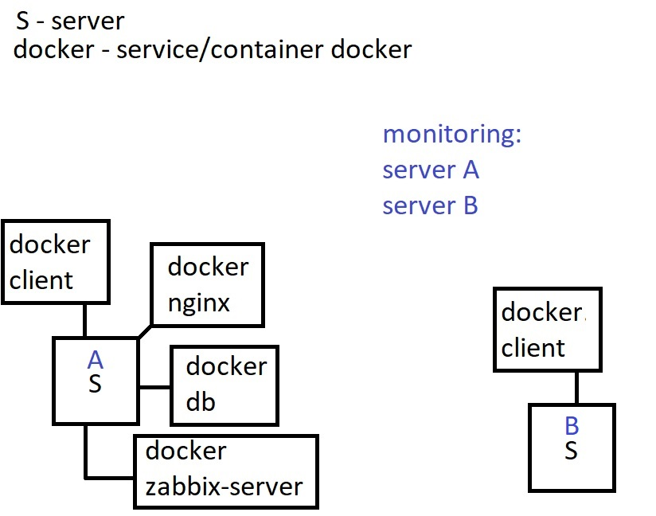

# Graduation Project

## About the creator:

- **Speciality**: System analysis
- **Full Name**: Shvydenko Dmitry
- **Senior**: 401k

## Idea

Learn how to easily analyze the system using Zabbix technology in a docker container.

## Tools

- **VirtualBox**: Allows us to raise 2 servers for research.
- **OS image**: ubuntu server 22.04.1 LTS
- **Docker / Docker-compose**: Allows us to deploy a monitoring system using a minimum of system resources. The main advantage is already written launch scripts.
- **zabbix - docker image**: Ready-made image, over which we will write an add-in.

## Script

All scripts that are used on the server are located in the server directories server(A/B).

## Idea visualization

